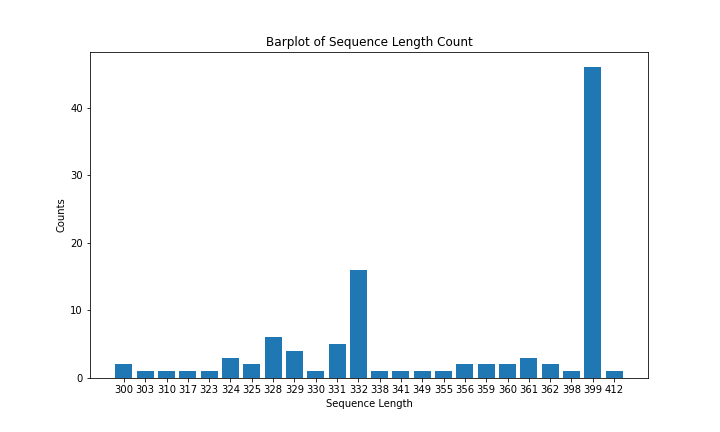
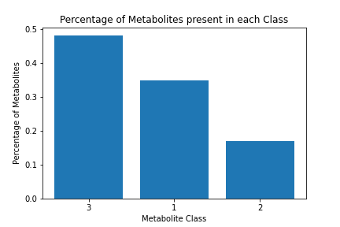
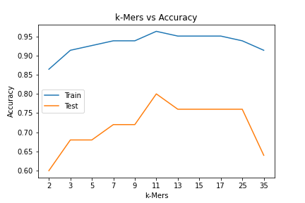
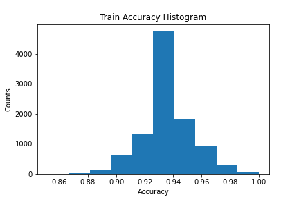

# Problem Statement
The goal of this project is to classify thioesterase enzymes based on their substrate affinity. The enzymes can be classfied into 3 labels:

1. The thioesterases which represent >50% specificity above C12 substrates AND <10% specificity for C12 and below
2. The thioesterases which have a mixed specificity.
3. Those which represents >50% specificity at or below C12 substrates AND  <10% specificity for above C12

# Input Data
The input dataset consists of thioesterase enzyme sequences as features and their corresponding subtrate specificity as labels.

## Number of instances
The number of thioesterase enzymes which have been characterized as are available as input data is 106. Each enzyme has its amino acid sequence specified. 

## Thioesterase sequence
The enzyme sequences are given as input. The length of the sequences range from 300 to 412. A barplot of the length of the sequences vs the number of instances is present below:

## Dataset imbalance
The dataset has a higher percentage of metabolites which classify as having >50% specificity at or below C12 substrates and <10% specificity for above C12 substrates. The figure below highlights this trait of the dataset.

## Cuphea viscosisssima enzyme class
This class of enzymes have highly similar sequence with extrememly low variance between sequences. However, they have varying substrate specificity. A machine learning model will be unable to distinguish in between sequences. Hence additional features characeteristic of specific enzymes is required to sucessfully classify this set of enzymes. 

**Show a plot depicting enzyme sequence similarity.** 

# Feature Representation
The following set of feature representations have been discussed.

## One-Hot Encoded
Each amino acid can be represented as a one-hot encoded vector. Since there are 20 amino acids, a vector of length 20 is defined with each index represented by an amino acid. For a specific amino acid, the index corresponding to that amino acid will be 1 and every other indices will be zero. Therefore if A is a vector whose index $a_i$ is represented by a specific amino acid $a$, then:

$\begin{equation}
A[i] = 
    \begin{cases}
        1, & \text{if}\ i = a_i\\
        0, & \text{otherwise}
    \end{cases}
\end{equation}$

Therefore a sequence of length N can be represented as a N\*20 matrix. This representation of a sequence is not only highly inefficient but it also fails to capture the contextual information in the data.

## Bag of Words representation
For a sequence of length N, Bag of Words (BoW) calculates the count of a particular amino acid in that sequence and divides that count by the length of the sequence. Thus it returns a vector A of length 20 (the number of amino acids) where:

$\begin{equation}
A[i] = \frac{\text{Count of amino acid i in the sequence}}{\text{Length of the sequence}}
\end{equation}$

This representation although highly efficient again falis to capture contextual information.

## k-mer motif builder
This representation is similar to the N-gram representation for language models. Here, the entire training dataset (all enzyme sequences) is scanned to search for all possible sequence motifs of length k. A feature set is created with sequence motifs which are repeated in atleast 2 instances of enzymes in the training data. This step is taken due to the following reasons: 

1. to avoid building a large set of features 
2. It is expected that enzymes of a specific substrate specificity will have common motifs and the main aim of the model is to learn these common motifs, not a motif specific to a particular enzyme.

Hypothetical Example:

Given 3 enzyme sequences $A_1$, $A_2$ and $A_3$ where

$A_1 = \text{'MLTPWS'}\\
A_2 = \text{'TTMLPT'}\\
A_3 = \text{'WSTPLM'}$

and choosing $k = 2$, the set of possible 2-mers are {'LP', 'LT', 'ML', 'PL', 'PW', 'ST', 'TM', 'TP', 'TT', 'WS'} among which only {'ML','TP'} are present in atleast two instances. Hence the feature set will be a one-hot encoded vector of length 2 with 'ML' as the first index and 'TP' as the second index. The feature representation for the enzymes will be as follows:

$\begin{equation} 
A_1 =  \begin{array}{r} [ & 1 & 1 &]  \end{array} \\
A_2 =  \begin{array}{r} [ & 1 & 0 &]  \end{array}\\
A_3 =  \begin{array}{r} [ & 0 & 1 &]  \end{array} \end{equation}$ 

This representation has a trade-off between storage efficiency and contextual information.

# Modeling Challenges
Considering the amount of training data and availability of features, a neural network model will be impractical to use due to the number of parameters required to train such a model. This problem has been discussed below. 

## Parameter Burst problem for deeper networks
Deep Neural Networks are data hungry and generally require thousands of instances per class as a rule of thumb. This number is obtained from the original ImageNet classification challenge, where the dataset had 1,000 categories, each with a bit less than 1,000 images for each class. In general, the required sample size is highly dependent on the number predictor parameters. Van Smeden, M. et al. conducted a study to determine the sample size for binary logistic regression model and according to them, more than 10 cases per predictor parameter is required to get a valid model that does not overfit on the training samples. In our case, even the k-mer motif builder method described above will require parameters in the range of hundreds to thousands depending on the k value while the simple one-hot encoded version requires $20 * n$ parameters where n is the number of amino acids we wish to inlcude in our model. For eg, if we wish to include the entire sequence of an enzyme of length 400, we will have to define $20*400$ or 8000 parameters. To take care of this problem, dimensionality reduction techniques like PCA or Encoder-Decoder can be used. Even then for deeper networks, the number of parameters described above is for the input layer itself. With each additional layer (convolutional, LSTM, max pooling or feed forward) the number of parameters increases further. Since we have 3 classes of enzymes, atleast 3000 training samples is a general rule of thumb. However the amount of training data depends on the complexity of the problem. There is no predefined standard that specifies the amount of training data and there are models that have good prediction accuracy with lesser training samples. Although in our case, even with data augmentation techniques, the number of training samples will be in hundreds. Since we have 3 different classes and sequential data, training a deep neural network with hundred training samples will not be prudent.  

Given the amount and type of training data, there are 4 modeling options:

1. Linear Regression
2. Naive-Bayes
3. Support Vector Machines 
4. Logistic Regression

We have looked at the assumptions made by each of these models to decide which one to use. 

## Linear Regression Assumptions
Linear Regression assumes that:

1. Linear relationship: There exists a linear relationship between the independent variable, x, and the dependent variable, y.

2. Independence: The residuals are independent. In particular, there is no correlation between consecutive residuals in time series data.

3. Homoscedasticity: The residuals have constant variance at every level of x.

4. Normality: The residuals of the model are normally distributed.

## Naive-Bayes Assumptions
Naive Bayes classifier assumes that:

1. the effect of the value of a predictor (x) on a given class (c) is independent of the values of other predictors.
2. the data is independent and identically distributed

## Support Vector Machine Assumptions
Suport Vector Machine classification problem assumes that:

1. the data is independent and identically distributed. 

## Logistic Regression Assumptions
Logistic Regression requires that:

1. the data is independent of each other. 
2. there is little or no multicollinearity among the independent variables.
3. assumes linearity of independent variables and log odds.

Since Support Vector Machine makes the least assumptions about the dataset, we have used an SVM model to classify the enzymes. 

# Model Formulation
The dataset was broken into training and test set with a 75%-25% split. The k-mer motif builder was used to create a feature space from enzyme sequences in the training set. The dimensionality of the feature space was reduced using Principal Component Analysis. A Support Vector Machine model was trained using the lower dimensional training set. 5-fold cross validation was carried out to learn the optimal set of hyperparameters. The optimal set of hyperparameters were used to retrain an SVM on the entire training set. The trained SVM was used to predict the enzyme classes of the test set.   
 
## Principal Component Analysis formulation
The steps involved in PCA are:
1. Standardization: The dataset is initially scaled so that each variable contributes equally. 

   $\begin{equation}z = \frac{x-\mu}{\sigma} \end{equation}$ 

    where $z$ is the scaled value, $x$ is the original value, $\mu$ is the mean of the variable and $\sigma$ is the standard deviation of the variable. 
    
2. Covariance Matrix Computation: The covariance of each variable is calculated using the following formula:

    $\begin{equation} cov(X,Y) = \frac{1}{n-1} \sum_{i=1}^{n} (X_i - \bar{X})(Y_i - \bar{Y}) \end{equation}$
    
    The results will be a square matrix of $N*N$ dimensions where $N$ is the number of variables. 
    
3. Eigen-Vector and Eigen Value Computation: The eigen vector $\mathbf{v}$ for a matrix $A$ can be calculated by solving the following formula:
    
    $\begin{equation} A\mathbf{v} - \lambda \mathbf{v}  = 0 \end{equation}$
    
4. Choosing k eigenvectors with the largest eigenvalues. These k eigenvectors become the Principal Components. A matrix $W$ is created by combining the k eigenvectors.

5. Recasting data along the Principal Components: Finally, the original sample space is projected along this new subspace via the following equation:
    
    $\begin{equation} \mathbf{Y} = W^T \mathbf{X} \end{equation}$ 
    where $\mathbf{Y}$ is the new sample space and $\mathbf{X}$ is the previous sample space. 

## Support Vector Machine Formulation
Given a training set of instance-label pairs $(\mathbf{x}_i,y_i), i = 1,...,l$ where $\mathbf{x}_i$ is a vector of features and $y_i$ is the label, support vector machine solves the following optimization problem:

$\begin{equation}
min_{w,b,\xi} \; \frac{1}{2} w^Tw + C \sum_{i=1}^l \xi_i \end{equation}$

subject to:

$\begin{equation} y_i(w^T \phi(x_i) + b) \geq 1 - \xi_i,\; \xi_i \geq 0. \end{equation}$

Here the training vector $\mathbf{x}_i$ is mapped to a higher dimensional space by the function $\phi$. $C$ is a penalty parameter for the error term $\xi$. The objective of the SVM is the find a separating hyperplane with the maximal margin between each class.

# Model Results
The model was trained with the following set of hyperparameters:

1. PCA components = 20
2. k-mer length k = 3
3. SVM C regularization parameter = 1
4. SVM kernel = rbf

The random seed was set at 7 to reproduce results. The initial model gave a test set accuracy of 0.64.

The hyperparameters of the PCA and SVM were optimized and the test accuracy increased to 0.68. The optimized hyperparameters were:

1. PCA components = 40
3. SVM C regularization parameter = 10
4. SVM kernel = rbf

Thereafter a study of model training and test accuracy against k-mer length k was performed. The result is shown below: 

It can be seen that k-length of 11 performed best on both training and test set. The test set accuracy achieved was 0.8.

To get a better estimate of the variance in model prediction, the model was simulated 10,000 times by varying the random seed with the above mentioned hyperparameters and k-mer length 11. This will result in different training data and initialization parameters for SVM.

A histogram of the train and test accuracy is shown below. 

The mean train accuracy was 0.93 and the mean test accuracy was 0.7. The standard deviation of train and test accuracy was 0.02 and 0.09 respectively. 

# Conclusion
The model variance is high and the model test accuracy is highly dependent on the training set. 

# Future Work
The model variance can be reduced by:

1. Increasing the training set. 
2. Adding relevant features.
3. Creating an ensemble model, where each individual model is trained on a subset of training samples and finally their combined prediction is taken into account.

## Addition of training data:

## Addition of relevant features:

# References

1. https://towardsdatascience.com/how-do-you-know-you-have-enough-training-data-ad9b1fd679ee
2. Olga Russakovsky*, Jia Deng*, Hao Su, Jonathan Krause, Sanjeev Satheesh, Sean Ma, Zhiheng Huang, Andrej Karpathy, Aditya Khosla, Michael Bernstein, Alexander C. Berg and Li Fei-Fei. (* = equal contribution) ImageNet Large Scale Visual Recognition Challenge
3. https://journals.sagepub.com/doi/full/10.1177/0962280218784726
